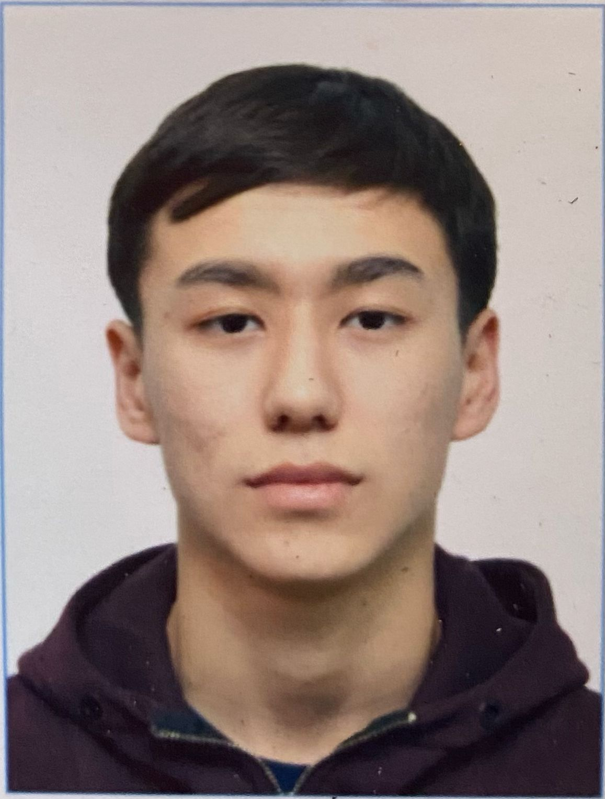

# Dinmukhammed Baiseitov 
---

## Contact information: 

** Phone: 87713815300

** E-mail: baiseitovdinmuhammed@gmail.com 

** Telegram: @dimashbaiseitov 

---

## Briefly about yourself: 
When I start one thing, I try my best to finish it. I myself was intrigued by this direction and, after studying it, realized that this profession is mine. And in this profession I need to study a lot and work a lot in practice.

And a lot of searching to find out new information I like, and I can quickly understand the information I got. I am studying at the university myself, majoring in Information Technology within an Information System.
I am interested in web development because this profession provides endless opportunities for professional growth,
in addition, there are a huge number of free high-quality resources for self-education and a large community of developers. I am sure that in the future I will become a strong specialist in this profession, that is, a Frontend developer.

---
## Skills and Proficiency: 
* Basic HTML5, CSS3
* JavaScript Basics
* VS Code

